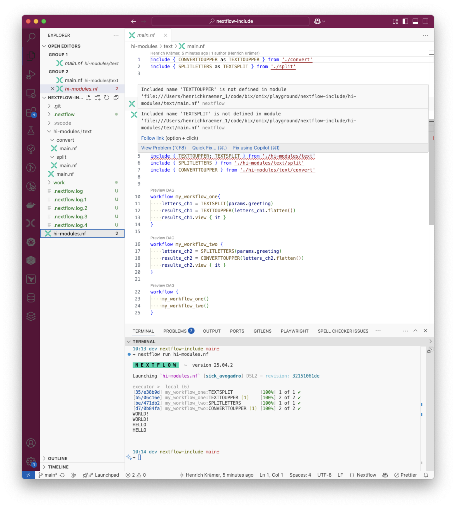

# nextflow indirect includes

## Issue Example

The following error occurs when attempting to use an indirect include in Nextflow:

After reading [GitHub issue #4128: Allow workflow entry from module import](https://github.com/nextflow-io/nextflow/issues/4128) it appears this is supported, but I am not too certain about that.
